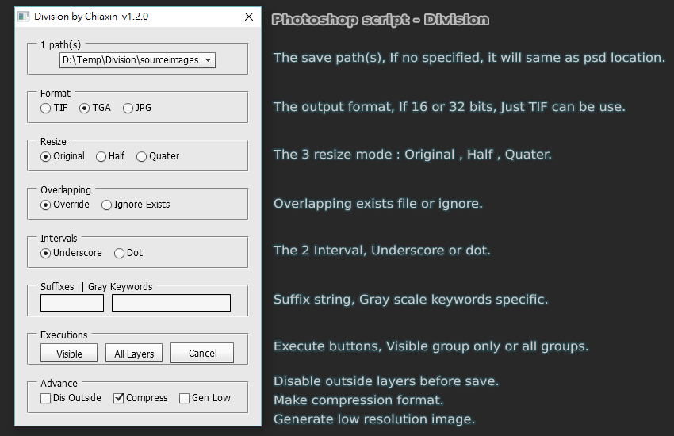

# Division

## Photoshop script

### This is a simple Photoshop script can be save each group out

#### Version : 1.2.0

## How to launch

+ In Photoshop, File -> Scripts -> Browse
+ Find Division.jsx, would be launch script UI

## How to use

+ Build several groups you want to export.
+ Create a "text layer" and key the full path you want to save.(can be multi).
+ If no path or directory is not exists, It will save path be same as PSD file.
+ Press "Visible" or "All Groups" button to process.
+ Output name is <PSD_NAME>\<INTERVAL>\<GROUP_NAME>\<SUFFIX>.\<Extension>

## Limit

+ The Photoshop file need saved before.
+ The group must has layer(not group), otherwise it would be ignored.
+ If color depth is not 8 bits, Just TIFF format can be export only.

## Photoshop Support

+ Photoshop CS6
+ Photoshop CC 2014
+ Photoshop CC 2015
+ Photoshop CC 2015.5
+ Photoshop CC 2017

## OS Support

Windows
