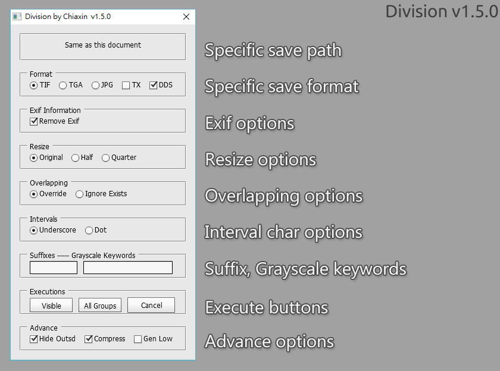
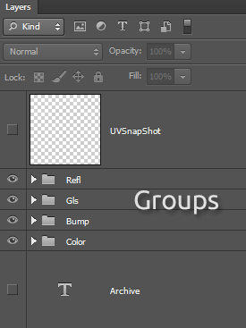

# Division

Extension Photoshop script can be save each group out.

## Version

1.5.0

## How to use

1. In Photoshop, File -> Scripts -> Browse
2. Choice Division.jsx in folder, it would be launch interface

## The Photoshop Groups

Build several groups you want to export. 
The final output name is \<psd-name>\<interval-char>\<group-name>\<suffix>.\<extension>

For example, we have four groups called "Refl", "Gls", "Bump" and "Color".

## The Save Path

You can specific path use "text" layer.  
The text layer regradness visible or level.  
It help script known where the directory you want to save.  
If no path found, It will be same as this psd's directory.

## Save Formats

Division have three format can be output - tif, tga and jpg.

## Dependencies

Division have 3 features need following dependencies.

|   Name                                                | Optional |
| ----------------------------------------------------- | -------- |
| [maketx](https://www.solidangle.com/arnold/)          |   Yes    | 
| [exiftool](https://sourceforge.net/projects/exiftool/)|   Yes    | 
| [texconv](https://github.com/Microsoft/DirectXTex)    |   Yes    |
  
## Make tx Function

Make tx is a new feature starts from 1.3. 
If set, Division will do maketx application after saved.

_txConfig.txt_ is make tx configuration.

+ bin=_maketx program_
+ arguments=_maketx argument_
+ colorspace=_environment color space_
+ colorconfig=_color conifg directory_
+ sRGB=_sRGB color space keywords_
+ Raw=_Raw color space keywords_
+ default=_Default color space_

## Convert dds Function

You have to include _texconv.exe_ application.  
Please see [DirectXTex](https://github.com/Microsoft/DirectXTex)

Convert dds file is a new feature starts from 1.5.  
If set, Division will convert image as dds after saved.

_ddsConfig.txt_ is convert dds configuration.

+ bin=texconv.exe
+ arguments=-f DDS -bcquick -y
+ input=-srgbi
+ default=-f BC7_UNORM_SRGB
+ normal=-f BC5_SNORM
+ alpha=-aw 0.0

## Remove EXIF Function

Remove exif information function starts from 1.4.

If set, it will remove exif information automatically by exiftool.  
The remove exif function need 3rd-Party application - "exiftool"  
Please download and place exiftool.exe into same as script's folder.  

[https://sourceforge.net/projects/exiftool/](https://sourceforge.net/projects/exiftool/)

## Resize

Resize options can resize image after saved.  
You can select half or quarter.

## Overlapping

If override is set, it will override every exists,  
else if ignore exists is set, it will skip any exists.

## Intervals

You can choice the "_" or "." between \<psd-name> and \<group-name>  
For example, you have a psd called myImages.psd and 2 groups called dif, bmp,  
If you select "Underscore", it will output two images called ***myImages_dif*** and ***myImages_bmp***.  
Or you select "Dot", it will output two images called ***myImages.dif*** and ***myImages.bmp***.

## Suffixes

You can specifc the suffix.  
For example, you fill suffix word ***".v1"***,  
It will output images called ***myImages.dif.v1***.  
And if you want no any suffix, just blank it.

## Grayscale Keywords

You can specific the keyword for auto convert image to grayscale,  
Sperate words by space. 
For example, you want the _Bump_, _Gls_, _Refl_ group to grayscale,  
Fill `Bump Gls Refl` into that area, It will convert them after saved.

## Advance Options

+ Hide Outsd (Hide outside) if set, 
  it will hide all layers in the world before saving.
+ Compress if set, it will make compression to image.
+ Gen low (Generate low resolution) if set,
  it will generate a quarter image and suffix ***.low***.

## Execute

+ Visible : Only visible groups would be save.
+ All Groups : All groups would be save.
+ Cancel : Quit.

## Limit

+ The Photoshop file need saved before.
+ The group must has a layer(not group) at least, otherwise it would be ignored.
+ If color depth is not 8 bits, Just TIFF format can be export only.

## Photoshop Support

+ Photoshop CS6
+ Photoshop CC 2014
+ Photoshop CC 2015
+ Photoshop CC 2015.5
+ Photoshop CC 2017

## OS Support

Windows
